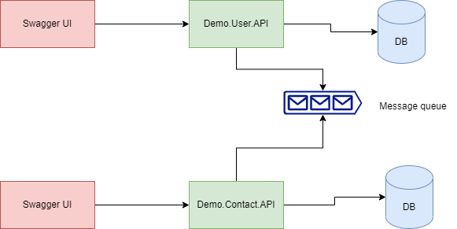

# Demo application build on microservices architecture

## High level diagram of application (Planned one, incomplete)

## High level diagram of application (completed, active one)

## Technology stack:
 - .NET7.0
 - RabbitMQ
 - xUnit
 - FulentAssertions
 - FluentValidations
 - NSubstitute
 - AutoFixture

 ## Database diagram
 

 ## Running Locally

 In order to run services locally:
 - NET7.0 should be installed on local machine
 - RabbitMQ should be installed on local machine with default configuration
 - Local SQL Server

 Code First approach used to create Database. First required to run following command to create database in local environment:
`Update-DataBase`

- Run both services and make some requests through Swagger UI or Postman

### How it works?

#### Demo.User.API
- When a `user` created through `Demo.User.API`, `user-created` event will be published to message queue that will be consumed by `Demo.Contact.API` and create contacts space for this user
- Update user through `Demo.User.API`, `user-updated` event will be published that will be consumed by `Demo.Contact.API` and updates user details in contacts database
- Delete user through `Demo.User.API`, `user-deleted` event will be published that will be consumed by `Demo.Contact.API` and deletes user details in contacts database

#### Demo.Contact.API
- `Demo.Contact.API` does not support creating a contact in its database, contact will only be created after user created through `Demo.User.API`
- When contact details of user changes in contacts database, `contact-updated` event will be published that will be consumed by `Demo.User.API` and updates contact of specified user
- Same for delete