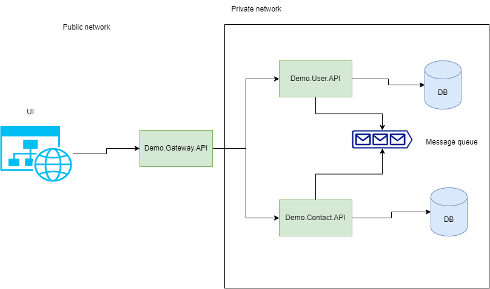
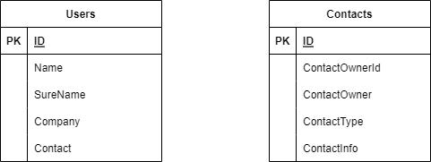

# Demo application build on microservices architecture

## High level diagram of application

## Technoligy stack:
 - .NET7.0
 - RabbitMQ
 - xUnit
 - FulentAssertions
 - FluentValidations
 - NSubstitute
 - AutoFixture

 ## Database diagram
 

 ## Running Locally

 In order to run services locally:
 - NET7.0 should be installed on local machine
 - RabbitMQ should be installed on local machine with default configuration
 - Local SQL Server